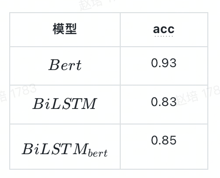

# knowledge_distillation

>原理详见：https://zhuanlan.zhihu.com/p/503739300?

## Distilling Task-Specific Knowledge from BERT into Simple Neural Networks 
> 代码参考：https://github.com/qiangsiwei/bert_distill
>
> 
使用BiLSTM蒸馏下游bert分类模型
### 训练步骤
先设置环境变量
```angular2html
export PYTHONPATH={PROJECT_PATH}
```
1. 使用预训练bert在特定数据集合fine-tuning
```angular2html
cd src/distill_task_specific_bert
python bert_classification.py
```
2. 用BiLSTM蒸馏fine-tuned bert
```angular2html
python distill.py
```
### 实验效果


## TinyBERT: Distilling BERT for Natural Language Understanding
> 代码链接：https://github.com/huawei-noah/Pretrained-Language-Model/tree/master/TinyBERT 

> 这里就不关注如何预训练，重点看看如何在下游任务fine-tuning

### 训练步骤
1. 环境准备
```angular2html
pip install -r requirements.txt
```
2. 数据准备  
这里可以是自己的数据集，也可以是GLUE任务。
3. 预训练模型  
Bert预训练模型在HuggingFace官网“Model”模块输入bert，找到适合自己的bert预训练模型，在“Files and versions”选择自己需要模型和文件下载，目前好像只能一个一个文件下载。
4. Transformer蒸馏
```angular2html
python task_distill.py --teacher_model ${FT_BERT_BASE_DIR}$ \
                       --student_model ${GENERAL_TINYBERT_DIR}$ \
                       --data_dir ${TASK_DIR}$ \
                       --task_name ${TASK_NAME}$ \ 
                       --output_dir ${TMP_TINYBERT_DIR}$ \
                       --max_seq_length 128 \
                       --train_batch_size 32 \
                       --num_train_epochs 10 \
                       --aug_train \
                       --do_lower_case  
```
5. 输出层蒸馏
```angular2html
python task_distill.py --pred_distill  \
                       --teacher_model ${FT_BERT_BASE_DIR}$ \
                       --student_model ${TMP_TINYBERT_DIR}$ \
                       --data_dir ${TASK_DIR}$ \
                       --task_name ${TASK_NAME}$ \
                       --output_dir ${TINYBERT_DIR}$ \
                       --aug_train  \  
                       --do_lower_case \
                       --learning_rate 3e-5  \
                       --num_train_epochs  3  \
                       --eval_step 100 \
                       --max_seq_length 128 \
                       --train_batch_size 32 
```


